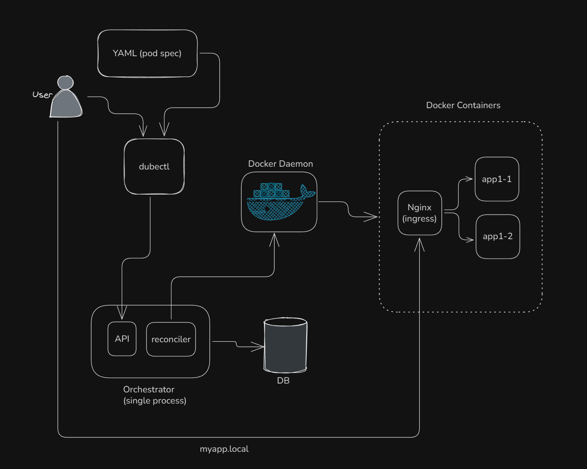
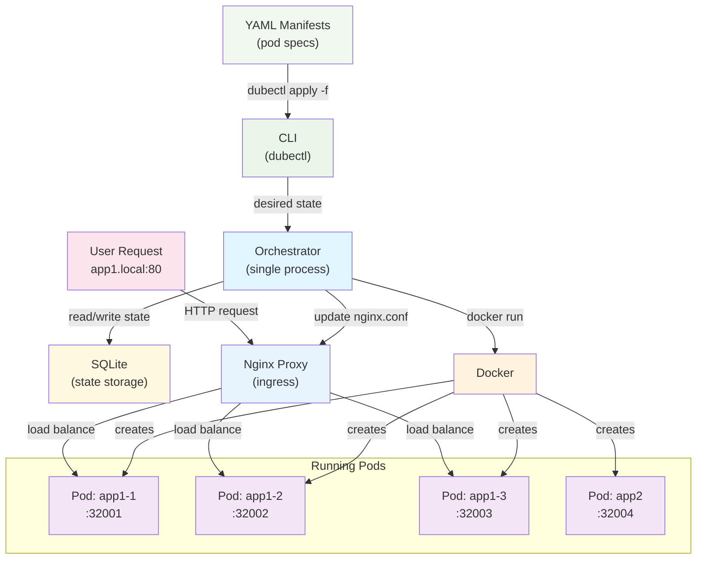

# Dubernetes

A simple and dumb container orchestration tool using Docker. This is a purely vibe coded (TDD) tool for learning
purposes, do not use it for anything other than that. I have not written a single line of code in this repo, it
is all done by claude. 

## How I used Claude

- Started brainstorming with claude-code
- Created a CLAUDE.md that works for me.  Check [HERE](./CLAUDE.md)
- Started with an architecture and high level vision. Check [HERE](./architecture.md)
- Created a detailed implementation plan. Check [HERE](./IMPLEMENTATION_PLAN.md)
- Claude started his work by using test driven development -- always write tests first

## What it does

- Deploy docker containers using simple YAML files
- Automatically restart failed containers
- Load balance traffic across multiple replicas
- Route traffic by hostname (like app.local)

## Architecture

### Overview



### Detailed



## Requirements

- Docker
- Go 1.24+

## Quick Start

1. Build the tools:
```bash
make build
```

2. Start the orchestrator:
```bash
./bin/orchestrator
```

3. Deploy a pod:
```bash
./bin/dubectl apply examples/whoami-service.yaml
```

4. Check running pods:
```bash
./bin/dubectl get pods
```

5. Test your app:
```bash
# Without modifying /etc/hosts
curl http://myapp.local --resolve myapp.local:80:127.0.0.1

# Or add to /etc/hosts for browser access
echo "127.0.0.1 myapp.local" >> /etc/hosts
```

## YAML Format

```yaml
name: whoami-service
image: traefik/whoami
replicas: 3
access:
  host: whoami.local
```

## Commands

- `dubectl apply <file>` - Deploy pods from YAML
- `dubectl get pods` - List running pods  
- `dubectl delete pods <name>` - Remove pods

## How it works

1. **dubectl** parses YAML and sends requests to the orchestrator
2. **Orchestrator** manages pod lifecycle and talks to Docker
3. **Nginx container** routes traffic to healthy containers  
4. **SQLite** persists state across restarts

The orchestrator runs on port 8080, nginx proxy container on port 80.

## Development

```bash
make test           # Run unit tests
make test-integration # Run integration tests
make check          # Format, vet, and test
```