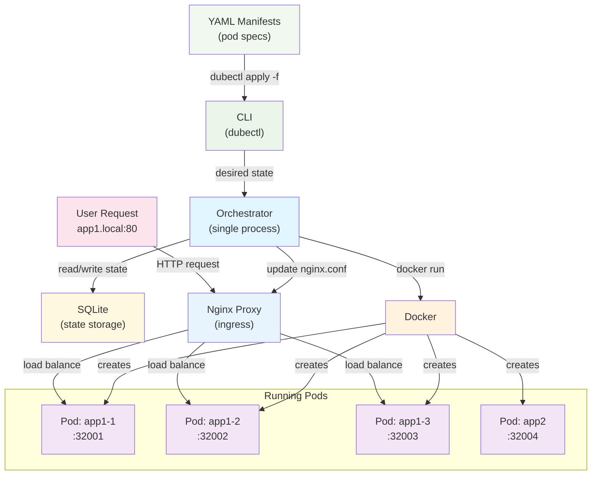

# Dubernetes Architecture

## Overview
Dubernetes is an ultra-simplified container orchestration system designed for learning how basic orchestration works behind the scenes.

## Architecture Diagram



## Core Components

### CLI Tool (dubectl)
Simple declarative interface:
- `dubectl apply -f <file.yaml>` - Deploy a pod from YAML manifest
- `dubectl get pods` - Show running pods
- `dubectl delete -f <file.yaml>` - Stop a pod

### Orchestrator
Single process that:
- Parses YAML manifests into desired state
- Manages pod lifecycle (create/stop/restart) with replicas
- Assigns random ports to containers (32001+)
- Updates SQLite database with pod state
- Generates and reloads nginx configuration for ingress
- Makes direct Docker API calls

### State Storage (SQLite)
Simple database for persistence:
```sql
CREATE TABLE pods (name TEXT, image TEXT, port INT, status TEXT, replica_id INT);
CREATE TABLE services (name TEXT, host TEXT, backend_ports TEXT);
```

### Ingress Proxy (Nginx)
Containerized nginx that:
- Listens on port 80 for all HTTP traffic
- Routes requests based on Host header
- Load balances across pod replicas using upstream blocks
- Configuration dynamically updated by orchestrator

### Container Runtime
Standard Docker for running containers

## Example Workflow

```yaml
# app1.yaml
name: app1
image: nginx:latest
replicas: 3
access:
  host: app1.local
```

```bash
# Deploy app with 3 replicas
dubectl apply -f app1.yaml

# Add to /etc/hosts
echo "127.0.0.1 app1.local" >> /etc/hosts

# Access the service (load balanced across 3 pods)
curl http://app1.local

# See what's running
dubectl get pods
# Output:
# NAME     IMAGE    STATUS   PORT     HOST
# app1-1   nginx    Running  32001    app1.local
# app1-2   nginx    Running  32002    app1.local  
# app1-3   nginx    Running  32003    app1.local

# Stop all replicas
dubectl delete -f app1.yaml
```

## YAML Specification

```yaml
name: string           # Pod name (required)
image: string          # Container image (required)
replicas: int          # Number of replicas (default: 1)
access:                # Ingress configuration (optional)
  host: string         # Host header for routing (e.g., app1.local)
```

## Key Learning Concepts

1. **Declarative Configuration**: Define desired state in YAML files
2. **Ingress & Load Balancing**: Single entry point routing to multiple replicas
3. **Service Discovery**: Host-based routing (app1.local → pods)
4. **Pod Lifecycle**: See containers start/stop in real-time with replicas
5. **State Management**: SQLite persistence across orchestrator restarts
6. **Container Abstraction**: Learn the pod → container relationship
7. **Dynamic Configuration**: Watch nginx config updates in real-time

## Implementation Details

### Generated Nginx Configuration
```nginx
upstream app1_backend {
    server 127.0.0.1:32001;
    server 127.0.0.1:32002;
    server 127.0.0.1:32003;
}

server {
    listen 80;
    server_name app1.local;
    
    location / {
        proxy_pass http://app1_backend;
        proxy_set_header Host $host;
        proxy_set_header X-Real-IP $remote_addr;
    }
}
```

### Container Startup
```bash
# For each replica:
docker run -d \
  --name app1-1 \
  -p 32001:80 \
  --label dubernetes.service=app1 \
  --label dubernetes.replica=1 \
  nginx:latest
```

## Design Goals

- **Maximum Simplicity**: One orchestrator, one proxy, minimal components
- **Real Concepts**: Ingress, load balancing, service discovery like K8s
- **Immediate Feedback**: See pods start and traffic route in real-time
- **Learning Focus**: Understand orchestration without enterprise complexity
- **Hands-on**: Deploy replicated services and see load balancing work