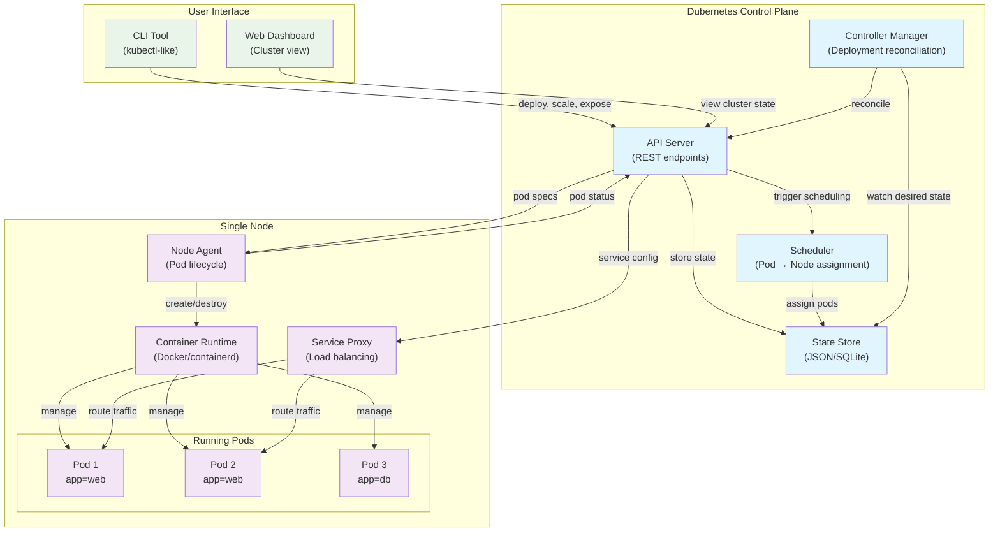

# Dubernetes Architecture

## Overview
Dubernetes is a simplified container orchestration system designed for learning how orchestration works behind the scenes.

## Architecture Diagram

## Core Components

### Control Plane
- **API Server**: REST endpoints for all operations
- **Scheduler**: Assigns pods to nodes based on resources
- **Controller Manager**: Maintains desired state (deployments, replicas)
- **State Store**: Persistent storage for cluster state

### Node Components
- **Node Agent**: Manages pod lifecycle on the node
- **Container Runtime**: Actually runs containers (Docker/containerd)
- **Service Proxy**: Handles load balancing and service discovery

### User Interface
- **CLI Tool**: kubectl-like interface for deployments
- **Web Dashboard**: Visual representation of cluster state

## Key Learning Flow

1. **User creates Deployment** via CLI
2. **API Server** stores desired state
3. **Controller** notices gap between desired/actual state
4. **Scheduler** assigns Pods to Node
5. **Node Agent** creates containers
6. **Service Proxy** handles load balancing
7. **Dashboard** shows real-time state changes

## Design Goals

- **Transparency**: Every decision is visible and explained
- **Simplicity**: Focus on core concepts without enterprise complexity
- **Educational**: Show the "magic" behind container orchestration
- **Hands-on**: Users can experiment and see immediate results