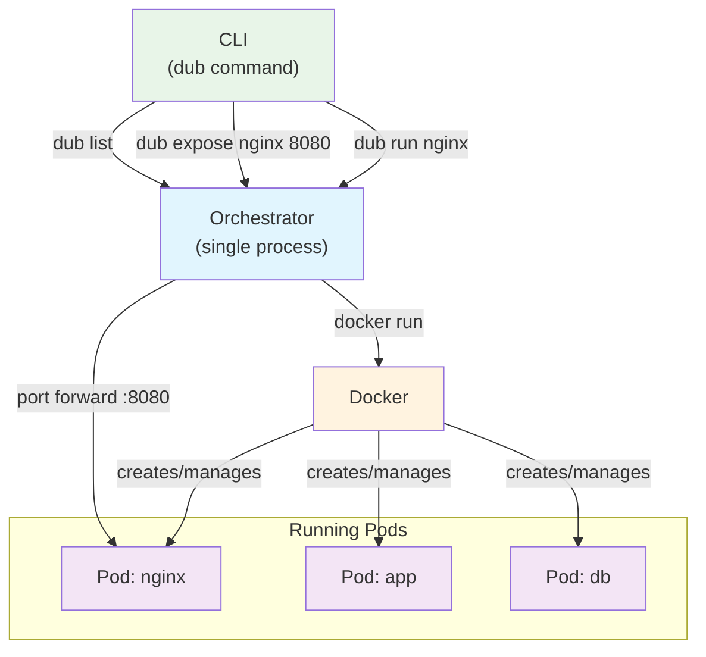

# Dubernetes Architecture

## Overview
Dubernetes is an ultra-simplified container orchestration system designed for learning how basic orchestration works behind the scenes.

## Architecture Diagram



## Core Components

### CLI Tool
Simple command interface:
- `dub run <name> --image <image>` - Deploy a pod
- `dub expose <name> --port <port>` - Expose pod on host port
- `dub list` - Show running pods
- `dub stop <name>` - Stop a pod

### Orchestrator
Single process that:
- Manages pod lifecycle (create/stop/restart)
- Handles port forwarding for services
- Maintains in-memory state of running pods
- Makes direct Docker API calls

### Container Runtime
Standard Docker for running containers

## Example Workflow

```bash
# Deploy nginx pod
dub run nginx --image nginx:latest

# Expose it on port 8080
dub expose nginx --port 8080

# Access the service
curl localhost:8080  # routes to nginx pod

# See what's running
dub list

# Stop the pod
dub stop nginx
```

## Key Learning Concepts

1. **Pod Lifecycle**: See containers start/stop in real-time
2. **Service Exposure**: Understand port forwarding vs load balancing
3. **State Management**: Watch how orchestrator tracks running pods
4. **Container Abstraction**: Learn the pod → container relationship

## Design Goals

- **Maximum Simplicity**: One process, minimal components
- **Immediate Feedback**: Every command shows what happens
- **Learning Focus**: Understand core concepts without complexity
- **Hands-on**: Deploy, expose, and manage pods in minutes